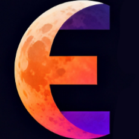

[![Contributors][contributors-shield]][contributors-url]
[![Forks][forks-shield]][forks-url]
[![Stargazers][stars-shield]][stars-url]
[![Issues][issues-shield]][issues-url]
[![License][license-shield]][license-url]

<!-- PROJECT LOGO -->
<br />
<p align="center">
  <a href="https://github.com/EvenToNight/EvenToNight">
    
  </a>

  <h3 align="center">EvenToNight</h3>

  <p align="center">
    Your social platform for events
    <br />
    <a href="https://eventonight.github.io/EvenToNight/"><strong>Explore the docs »</strong></a>
    <br />
    <br />
    <a href="https://eventonight.site/">View Demo</a>
    ·
    <a href="https://github.com/EvenToNight/EvenToNight/issues">Report Bug</a>
    ·
    <a href="https://github.com/EvenToNight/EvenToNight/issues">Request Feature</a>
  </p>
</p>

---

<!-- TABLE OF CONTENTS -->
<details>
  <summary>Table of Contents</summary>
  <ol>
    <li>
      <a href="#about-the-project">About The Project</a>
      <ul>
        <li><a href="#key-features">Key Features</a></li>
        <li><a href="#built-with">Built With</a></li>
      </ul>
    </li>
    <li>
      <a href="#getting-started">Getting Started</a>
      <ul>
        <li><a href="#prerequisites">Prerequisites</a></li>
        <li><a href="#installation">Installation</a></li>
      </ul>
    </li>
    <li><a href="#usage">Usage</a></li>
    <li><a href="#project-structure">Project Structure</a></li>
    <li><a href="#contributing">Contributing</a></li>
    <li><a href="#license">License</a></li>
    <li><a href="#contact">Contact</a></li>
    <li><a href="#acknowledgements">Acknowledgements</a></li>
  </ol>
</details>

## About The Project

**EvenToNight** is a digital platform designed to connect organizations promoting social events with users interested in discovering and participating in them. The platform features a **social network-style interface**, making the user experience simple, intuitive, and engaging.

The platform is accessible **without authentication**, allowing users to browse public events without creating an account, while providing organizations with a **public showcase** to promote their activities and reach a wider audience.

Users can register as either **organizations** or **members**, each with tailored features and capabilities. Registered users gain access to the complete set of platform features, including:

- **Save favorite content** and manage personalized collections
- **Follow organizations and members** to stay updated on new events and activities
- **Real-time chat service** to contact organizations for technical assistance and event information
- **Review system** to leave feedback on attended events, contributing to organization credibility
- **Intelligent search and filtering** by newest additions, trending events, personal interests, and location
- **Collaborative events** where organizations can specify collaborators to co-host events and grow their community

<!-- Add a demo gif or screenshot here -->
<!--
<p align="center">
  <a href="https://github.com/EvenToNight/EvenToNight">
    
  </a>
</p>
-->

The platform supports **internationalization (i18n)**.

### Built With

**Frontend**
- Vue 3
- TypeScript
- Quasar Framework
- Pinia
- Vue Router
- Vue I18n
- Socket.io Client
- Vite

**Backend (Microservices)**
- Scala 3
- Cask
- Circe
- Undertow
- NestJS
- Express
- Node.js
- MongoDB
- Mongoose
- RabbitMQ
- JWT
- Socket.io
- Stripe
- PDFKit
- QRCode
- AWS S3
- Multer
- STTP
- Gradle

**Infrastructure & DevOps**
- Docker & Docker Compose
- Keycloak
- Traefik

**Testing & Quality**
- Jest
- ScalaTest
- Lighthouse
- ESLint
- Prettier
- ScalaFix
- ScalaFmt

## Getting Started

To get a local copy up and running, follow these simple steps.

### Prerequisites

- [Java](https://www.oracle.com/java/technologies/downloads/) 21 or higher
- [Docker](https://www.docker.com/)

### Installation

1. Clone the repository

```bash
git clone https://github.com/EvenToNight/EvenToNight.git
cd EvenToNight
```

2. Configure environment variables

```bash
cp .env.template .env
# Edit .env and fill all required fields
# Note: If using --no-deps flag, Stripe keys can be filled with any value. All values MUST be filled.
```

3. Deploy the application

#### Option A: Using pre-built images from ghcr.io (Recommended)

**Download latest images:**
```bash
./scripts/composeApplication.sh pull
```

**Download latest images with database seeding:**
```bash
./scripts/composeApplication.sh --init-db pull
```

**Deploy application:**
```bash
./scripts/composeApplication.sh up -d --wait
```

**Deploy with database seeding:**
```bash
./scripts/composeApplication.sh --init-db up -d --wait
```

**Deploy in development mode** (with mapped ports and dashboards for databases/RabbitMQ/Traefik):
```bash
./scripts/composeApplication.sh --init-db --dev up -d --wait
```

#### Option B: Build locally

Add the `--build` flag to build services locally instead of using pre-built images:

```bash
# Build and deploy
./scripts/composeApplication.sh up --build -d --wait

# Build and deploy with seeding
./scripts/composeApplication.sh --init-db up --build -d --wait
```

#### Additional Flags

**`--no-deps`**: Skip external dependencies (Stripe)

You can add `--no-deps` to any deploy command to skip external service dependencies:

```bash
# Deploy without external dependencies
./scripts/composeApplication.sh --no-deps up -d --wait

# Deploy with seeding but without external dependencies
./scripts/composeApplication.sh --init-db --no-deps up -d --wait
```

**Note:** When using `--no-deps`, Stripe keys in `.env` can be filled with any value.

4. **For Stripe payments in local environment** (required only if NOT using `--no-deps`):

```bash
./services/payments/scripts/local-webhooks.sh
```

This script must be run to forward Stripe webhooks to your local environment.

### Alternative Setup

Use Gradle to set up the entire environment with seeding and Stripe listener:

```bash
./gradlew setupApplicationEnvironment
```

### Teardown

**Stop application:**
```bash
./scripts/composeApplication.sh down --wait
```

**Stop and remove volumes:**
```bash
./scripts/composeApplication.sh down -v --wait
```

## Usage

### For Event Organizers

1. **Create an Account**: Sign up as an event organizer
2. **Create Events**: Fill in event details, upload posters, set dates and locations
3. **Manage Tickets**: Configure ticket types and pricing

### For Attendees

1. **Discover Events**: Browse and search for events based on your interests
2. **Purchase Tickets**: Secure your spot with integrated ticket purchasing
3. **Stay Connected**: Follow organizers and other attendees
4. **Share Feedback**: Rate and review events you've attended

## Contributing

Contributions are what make the open source community such an amazing place to learn, inspire, and create. Any contributions you make are **greatly appreciated**.

1. Fork the Project
2. Create your Feature Branch (`git checkout -b feature/amazing-feature`)
3. Commit your Changes (`git commit -m 'feat: add some amazing feature'`)
4. Push to the Branch (`git push origin feature/amazing-feature`)
5. Open a Pull Request

### Coding Standards

- Follow the existing code style
- Write meaningful commit messages using [Conventional Commits](https://www.conventionalcommits.org/)
- Add tests for new features
- Ensure accessibility compliance
- Update documentation as needed

## License

Distributed under the GPL-3.0 License. See [LICENSE](LICENSE) for more information.

## Authors

- [Federico Bravetti](https://github.com/Fede802)
- [Tommaso Brini](https://github.com/TommasoBrini)
- [Alice Alfonsi](https://github.com/alicealfonsi)


<!-- MARKDOWN LINKS & IMAGES -->
[contributors-shield]: https://img.shields.io/github/contributors/EvenToNight/EvenToNight.svg?style=flat-square
[contributors-url]: https://github.com/EvenToNight/EvenToNight/graphs/contributors
[forks-shield]: https://img.shields.io/github/forks/EvenToNight/EvenToNight.svg?style=flat-square
[forks-url]: https://github.com/EvenToNight/EvenToNight/network/members
[stars-shield]: https://img.shields.io/github/stars/EvenToNight/EvenToNight.svg?style=flat-square
[stars-url]: https://github.com/EvenToNight/EvenToNight/stargazers
[issues-shield]: https://img.shields.io/github/issues/EvenToNight/EvenToNight.svg?style=flat-square
[issues-url]: https://github.com/EvenToNight/EvenToNight/issues
[license-shield]: https://img.shields.io/github/license/EvenToNight/EvenToNight.svg?style=flat-square
[license-url]: https://github.com/EvenToNight/EvenToNight/blob/main/LICENSE
