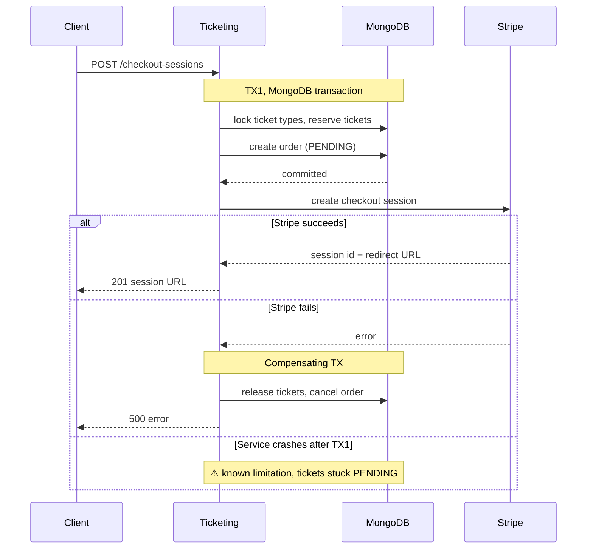

# 5 - Implementation

Full API documentation has been produced for all services:

- [**OpenAPI specs** (REST)](https://eventonight.github.io/EvenToNight/openAPI/).
- [**AsyncAPI specs** (RabbitMQ)](https://eventonight.github.io/EvenToNight/asyncAPI/).

The sections below cover implementation choices not captured by the API specifications.

## 5.1 - Technological details

**In-transit data representation**

All REST APIs and RabbitMQ messages use **JSON** as the serialization format.

**Database querying**

All application services use **MongoDB** as their document store:

- `user` and `event` (Scala) query MongoDB via the raw Java driver (`mongodb-driver-sync`).

- `chat`, `interaction`, `notification` and `ticketing` (Typescript) use **Mongoose** as the ODM, with schema decorators and typed model queries.

The `media` service stores binary files in **MinIO**, an S3-compatible self-hosted object store. PostgreSQL is only used internally by Keycloak.

**Authentication**

Authentication is handled by **Keycloak**. On login, Keycloak issues a short-lived JWT access token and a longer-lived refresh token. Every protected API endpoint requires a `Authorization: Bearer <token>` header. Each service validates the JWT independently using Keycloak's RSA public key, the `user` service exposes a `/public-keys` endpoint that the other services fetch at startup. No centralised auth gateway is involved in validating requests.

The frontend stores tokens in `sessionStorage`, automatically refreshes the refresh token before expiry and injects access token into all outgoing requests.

**Authorization**

The system uses **Role-Based Access Control (RBAC)** with two roles: `member` and `organization`. Roles are assigned in Keycloak at registration time and embedded in the JWT. Services extract the role from the token and apply authorization logic at the handler level, for example, only an `organization` can create events and only the owning user can modify their own resources.

**RabbitMQ message format**

All domain events published to the `eventonight` topic exchange share a common envelope:

```json
{
  "eventType": "event.published",
  "occurredAt": "2025-01-01T12:00:00Z",
  "payload": { ... }
}
```

**MongoDB single-node replica set**

MongoDB transactions require a replica set. All services run MongoDB in replica set mode even on a single node, using `--replSet rs0` and initialising a one-member replica set at startup. This setup unlocks multi-document transaction support and makes the transition to a multi-node replica set in a Swarm deployment straightforward, with no changes required to the application layer.

**Stripe webhook authentication**

Stripe signs every webhook payload using a secret. The `ticketing` service verifies this signature before processing any incoming webhook, ensuring that only legitimate Stripe events are accepted.

**Socket.IO: authenticated connections and scaling**

WebSocket connections to the `notification` service are authenticated: the client sends its JWT and `userId` during the Socket.IO handshake and the server validates the token before allowing the connection. Socket.IO was chosen over raw WebSocket also because it natively supports a Redis pub/sub adapter, which would allow the `notification` service to scale horizontally across multiple replicas while still delivering pushes to the correct client regardless of which replica it is connected to.

**Key implementation patterns**

- **Transactional outbox**: each service writes domain events to an outbox collection atomically with the state change (within a MongoDB transaction); a relay process forwards them to RabbitMQ, retrying with exponential backoff until delivery succeeds. This decouples message publishing from the availability of RabbitMQ.

- **Saga pattern**: the ticket purchase flow is implemented as a two-phase saga. Phase 1 reserves inventory and creates an order atomically in MongoDB (TX1). Phase 2 calls Stripe to create a checkout session. If Stripe fails, a compensating transaction releases the reserved tickets and cancels the order. If the service crashes between the two phases, the compensation does not run, tickets remain in `PENDING` state indefinitely. The correct mitigation would be a scheduled cleanup job that releases orders stuck in `PENDING` beyond a timeout threshold; this is a known limitation of the current implementation.




## 5.2 - Service architecture patterns

Services adopt different internal architectural styles.

**Clean Architecture (`ticketing`, `user`, `event`, `notification`)**

Some services are structured around **Clean Architecture** with **Domain-Driven Design** principles. The codebase is organised into four layers with strict inward dependency rules:

- `domain/`: contains aggregates, value objects, domain events, repository interfaces and domain service interfaces. No dependency on any framework or infrastructure.
- `application/`: contains use cases, application services and DTOs. Orchestrates domain logic without touching infrastructure directly.
- `infrastructure/`: contains concrete implementations of repository interfaces (MongoDB), external service adapters (Stripe, Keycloak), mappers between domain objects and persistence schemas.
- `presentation/`: contains HTTP controllers, RabbitMQ consumers and WebSocket gateways. Translates inbound requests into application-layer calls.

This separation ensures that domain logic is fully isolated from infrastructure concerns and it's independently testable. Within this structure, the organization of the application layer varies by service: `event` and `notification` use **Command Query Responsibility Segregation** (CQRS) pattern, with write operations represented as commands and read operations as queries, each handled by a dedicated class. The remaining services use a unified application service or handler approach without explicit read/write separation. The current implementation uses a single shared data model for reads and writes; fully separating the read and write models would unlock further performance and scalability gains and is a natural evolution of the current design.

**NestJS module organisation (`chat`, `interaction`)**

Some services adopt the **NestJS default module structure**: the codebase is organised by feature module (e.g. `conversations`, `users` in `chat`), each encapsulating its own controllers, services and Mongoose schemas.