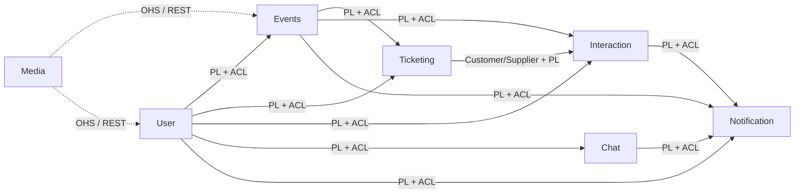

# 2 - Design

The system has been designed following a **microservices architectural style**, where each service models a specific subdomain and exclusively owns its data. 

The principal objectives of the design phase were:

- service **autonomy** and independent deployability;
- **isolated persistence** per service: no service ever reads or writes another service's database directly;
- **scalability and fault isolation** at the service granularity;
- **local strong consistency** within each service, complemented by **eventual consistency** across services;
- **separation of responsibilities** aligned with the partitioning of the business domain.

To ensure separation of responsibilities, the identification of domain entities and service boundaries has been guided by principles inspired by Domain-Driven Design (DDD).

The platform is articulated into autonomous **bounded contexts**, each one shipped as an independent microservice and communicating with the others either synchronously over HTTP (for request issued by the frontend) or asynchronously through domain events on a shared RabbitMQ broker (for every state-changing cross-context interaction). 

The remainder of this chapter documents that design, from the event-storming sessions that bootstrapped the model to the strategic decomposition into bounded contexts, the tactical patterns adopted inside each service, and the integration mechanisms that keep the system loosely coupled while remaining consistent.

## 2.1 Strategic Design

The domain of this project is *connecting organizations that promote social events with users interested in discovering and participating in them*. 

The model that supports this domain was distilled collaboratively through Event Storming and consolidated as the glossary of the ubiquitous language.

### 2.1.1 Event Storming

The DDD model emerges from a sequence of collaborative **Event Storming** sessions, each producing one of the diagrams reproduced below. The sessions were carried out on a shared [LucidChart board](https://lucid.app/lucidchart/ba6c762a-70a7-4fc0-8aee-00e68e1f82e0/edit?invitationId=inv_e7f16288-d064-498b-aeb2-6fa7e3444695&page=0_0#).

A consistent colour code is used across the three levels: **orange** for domain events (facts, past tense), **blue** for commands (the intent that triggers an event), **yellow ovals** for aggregates that receive commands and emit events, **purple** for policies (`whenever X happens then Y`), and **light yellow** for *hotspots* — open questions and conflicts to be resolved.

#### Big Picture Event Storming

The first session collected every relevant domain event as a past-tense fact, with no order, command or aggregate attached yet; just the raw vocabulary of the domain, clustered loosely by topic.

    
     

#### Process Modeling Event Storming

A second pass ordered the events along temporal arrows, surfaced open questions as **hotspots** (yellow stickies, addressed in the rest of the chapter) and promoted a small subset of events to **pivotal** by drawing a thicker border: `Member Created`, `Organization Created`, `Event Published`, `Order Confirmed` and `Event Completed`. Around the pivotal events the team made explicit the **policies** the system runs automatically; the convergence of every cross-context policy on `Notification Created` is the strongest evidence that Notifications deserves to be extracted as a context of its own, a decision finalised at the next level.

    
     

#### Software Design Event Storming

The third pass introduced the only technical element: aggregates. For each command, the team identified the aggregate that validates it and emits the resulting event; clustering aggregates by linguistic cohesion yielded the seven bounded contexts shown in the figure, which became the seven microservices of §2.2.

| Bounded context | Aggregates |
|---|---|
| User | `Member`, `Organization` |
| Media | `Media` |
| Events | `Event` |
| Notification | `Notification` |
| Chat | `Conversation`, `Message` |
| Interaction | `Follow`, `Like`, `Review`, `Participation` |
| Ticketing | `Order`, `Ticket` |

    
     

## 2.2 Ubiquitous Language

The ubiquitous language is the glossary that the team and the code use to talk about the domain. The following table collects the terms that recur both in the report and in the source code, with the bounded context that owns each definition. Anywhere two contexts use the same word, they may give it a *different* meaning: that is intentional and is what justifies the translation step performed by the Anti-Corruption Layers.

| Term | Owner context | Meaning |
|---|---|---|
| **Member** | User | A registered physical person, attendee of events |
| **Organization** | User | A registered entity that creates and runs events |
| **RegisteredUser** | User | Sealed family that covers both `Member` and `Organization` |
| **Event** (entity) | Event | A social event scheduled by an organization; has a lifecycle `DRAFT → PUBLISHED → (CANCELLED \| COMPLETED)` |
| **Collaborator** | Event | An organization, other than the creator, that co-hosts an event |
| **EventTicketType** | Ticketing | A purchasable tier of tickets for a given event (price, available quantity, sold quantity) |
| **Ticket** | Ticketing | A single seat sold to a single attendee; has its own lifecycle `PENDING_PAYMENT → ACTIVE → (USED \| REFUNDED \| CANCELLED \| PAYMENT_FAILED)` |
| **Order** | Ticketing | The transactional grouping of tickets bought together in one checkout session |
| **CheckoutSession** | Ticketing | The Stripe-hosted payment session that confirms or expires an order |
| **Like** / **Review** / **Participation** | Interaction / Notification | The three ways a member interacts with an event |
| **Follow** | Interaction / Notification | The directed relationship `follower → followed` between two users |
| **Conversation** / **Message** | Chat | A two-party private chat between any pair of users |
| **Notification** | Notifications | A user-facing fact derived from a domain event, possibly delivered in real time |
| **Domain Event** | (shared) | A fact, named in past tense, that the publishing context guarantees happened (e.g. `EventPublished`, `OrderConfirmed`) |

## 2.3 Bounded contexts and microservices

The bounded contexts identified at the third event-storming level are mapped one-to-one to deployable microservices. Each microservice owns its persistence, exposes an HTTP API for synchronous reads issued by the frontend, and exchanges domain events with the others through RabbitMQ.

| Bounded context | Microservice | Stack | Persistence | Responsibility |
|---|---|---|---|---|
| Identity & User Management | [`users`](https://github.com/EvenToNight/EvenToNight/tree/main/services/users) | Scala 3 (Cask) | MongoDB + Keycloak | Registration, profile management, authentication tokens |
| Event Catalog | [`events`](https://github.com/EvenToNight/EvenToNight/tree/main/services/events) | Scala 3 (Cask) | MongoDB | Lifecycle of `Event`, tags, search, filtering |
| Ticketing & Sales | [`ticketing`](https://github.com/EvenToNight/EvenToNight/tree/main/services/ticketing) | NestJS | MongoDB + Stripe | Ticket types, checkout, tickets, orders, PDF / QR generation |
| Social Interactions | [`interactions`](https://github.com/EvenToNight/EvenToNight/tree/main/services/interactions) | NestJS | MongoDB | Likes, reviews, participations, follows, projections of events / users used for cross-cutting validation |
| Chat | [`chat`](https://github.com/EvenToNight/EvenToNight/tree/main/services/chat) | NestJS + Socket.IO | MongoDB | Real-time private conversations |
| Notifications | [`notifications`](https://github.com/EvenToNight/EvenToNight/tree/main/services/notifications) | Node.js (Express) + Socket.IO | MongoDB | Persistent notification feed and real-time push |
| Media Storage | [`media`](https://github.com/EvenToNight/EvenToNight/tree/main/services/media) | NestJS | S3-compatible bucket, MinIo | Generic upload / download of binary assets |

### Domain Model overview

    
     

### Context map

The relationships between bounded contexts are classified with the standard DDD context-map vocabulary. Each arrow goes from the **upstream** context to the **downstream** consumer, and is labelled with the pattern that governs the integration:

- **Published Language (PL)** -> the publisher commits to a stable event envelope and routing-key contract;
- **Anti-Corruption Layer (ACL)** -> the consumer translates the upstream payload into its own internal types;
- **Customer / Supplier** -> a stronger relationship where the downstream's needs influence the upstream's release schedule;
- **Open Host Service (OHS)** -> a synchronous REST contract, used by the generic Media context.

Two structural observations follow directly from this map:

1. **Notification is the system's pure downstream** — it consumes from at least five different publishers and emits no business event of its own. This convergence is what justified extracting Notification as a context of its own already at the third Event-Storming level.
2. **Media is the only synchronous integration** — it is invoked over HTTP by the contexts that need to store posters and avatars; the contract is a thin REST API, not a Published Language. Every other inter-context communication is asynchronous over RabbitMQ.

