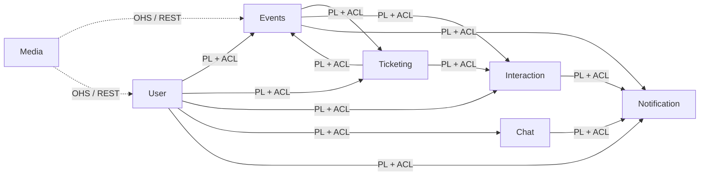
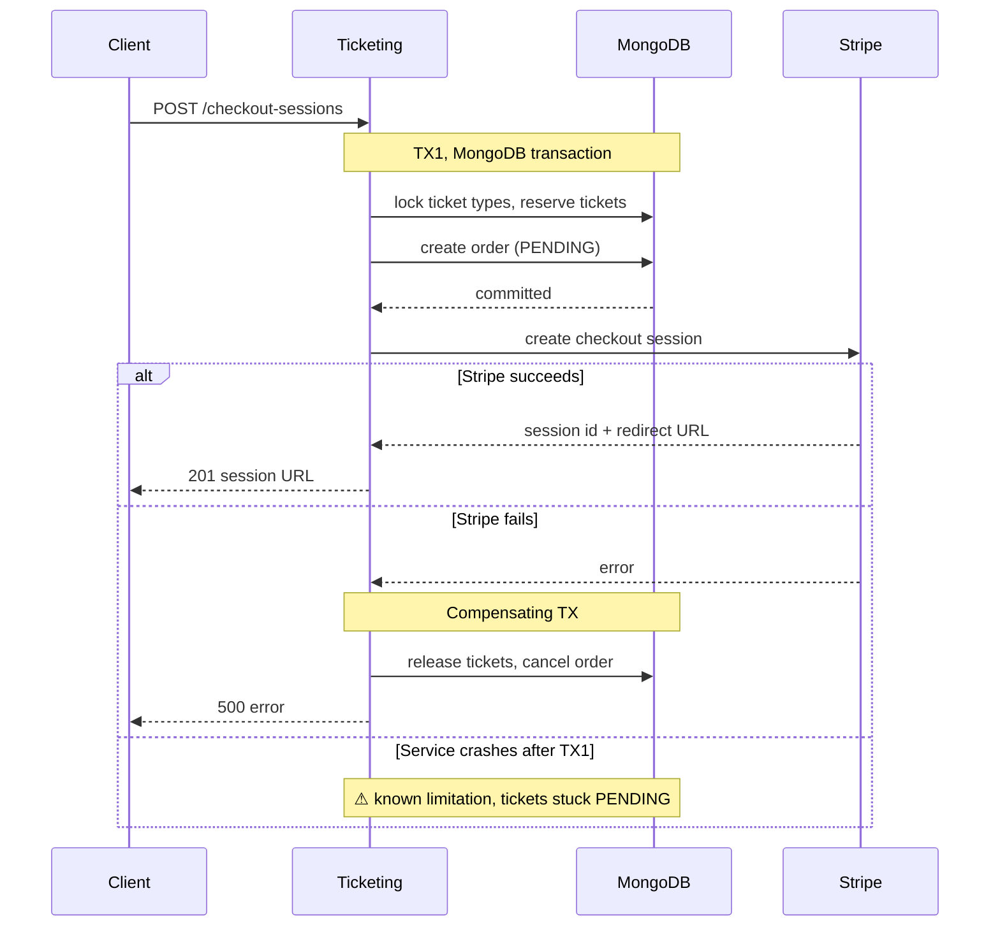

# 2 - Design

The system has been designed following a **microservice architectural style**, where each service models a specific subdomain and exclusively owns its data. 

The principal objectives of the design phase were:

- service **autonomy** and independent deployability;
- **isolated persistence** per service: no service ever reads or writes another service's database directly;
- **scalability and fault isolation** at the service granularity;
- **local strong consistency** within each service, complemented by **eventual consistency** across services;
- **separation of responsibilities** aligned with the partitioning of the business domain.

To ensure separation of responsibilities, the identification of domain entities and service boundaries has been guided by principles inspired by Domain-Driven Design (DDD).

The platform is articulated into autonomous **bounded contexts**, each one shipped as an independent microservice and communicating with the others either synchronously over HTTP (for request issued by the frontend) or asynchronously through domain events on a shared RabbitMQ broker.

## 2.1 Domain

The domain of this project is *connecting organizations that promote social events with users interested in discovering and participating in them*. 

This domain was modelled through Event Storming, from which the glossary that constitutes the ubiquitous language was then derived.

### 2.1.1 Event Storming

The DDD model emerges from a sequence of collaborative **Event Storming** sessions, each producing one of the diagrams reproduced below. The sessions were carried out on a shared [LucidChart board](https://lucid.app/lucidchart/ba6c762a-70a7-4fc0-8aee-00e68e1f82e0/edit?invitationId=inv_e7f16288-d064-498b-aeb2-6fa7e3444695&page=0_0#).

#### Big Picture Event Storming

The first session collected every relevant domain event as a past-tense fact, with no order, command or aggregate attached yet; just the raw vocabulary of the domain, clustered loosely by topic.

<p align="center">
    
    <br />
</p>

#### Process Modeling Event Storming

A second pass ordered the events along temporal arrows, surfaced open questions as **hotspots** (yellow post-it, addressed in the rest of the chapter) and promoted a small subset of events to **pivotal** by drawing a thicker border. Around the pivotal events the team made explicit the **policies** the system runs automatically; the convergence of every cross-context policy on `Notification Created` is the strongest evidence that Notifications deserves to be extracted as a context of its own, a decision finalised at the next level.

<p align="center">
    
    <br />
</p>

#### Software Design Event Storming

The third pass introduced the only technical element: aggregates. For each command, the team identified the aggregate that validates it and emits the resulting event; clustering aggregates by linguistic cohesion yielded the seven bounded contexts shown in the figure, which became the seven microservices.

<p align="center">
    
    <br />
</p>

## 2.2 Ubiquitous Language

The ubiquitous language is the shared vocabulary that both the team and the code use to describe the domain. The following table collects the terms that recur both in the report and in the source code, with the bounded context that owns each definition. Anywhere two contexts use the same word, they may give it a *different* meaning: that is intentional and is what justifies the translation each context applies when consuming another context's domain events.

| Term | Owner context | Meaning |
|---|---|---|
| **Member** | User | A registered physical person, attendee of events |
| **Organization** | User | A registered entity that creates and runs events |
| **RegisteredUser** | User | Sealed family that covers both `Member` and `Organization` |
| **Event** (entity) | Event | A social event scheduled by an organization; has a lifecycle `DRAFT → PUBLISHED → (CANCELLED \| COMPLETED)` |
| **Collaborator** | Event | An organization, other than the creator, that co-hosts an event |
| **EventTicketType** | Ticketing | A purchasable tier of tickets for a given event (price, available quantity, sold quantity) |
| **Ticket** | Ticketing | A single seat sold to a single attendee; has its own lifecycle `PENDING_PAYMENT → ACTIVE → (USED \| REFUNDED \| CANCELLED \| PAYMENT_FAILED)` |
| **Order** | Ticketing | The transactional grouping of tickets bought together in one checkout session |
| **CheckoutSession** | Ticketing | The Stripe-hosted payment session that confirms or expires an order |
| **Like** / **Review** / **Participation** | Interaction / Notification | The three ways a member interacts with an event |
| **Follow** | Interaction / Notification | The directed relationship `follower → followed` between two users |
| **Conversation** / **Message** | Chat | A two-party private chat between any pair of users |
| **Notification** | Notifications | A user-facing fact derived from a domain event, possibly delivered in real time |
| **Domain Event** | (shared) | A fact, named in past tense, that the publishing context guarantees happened (e.g. `EventPublished`, `OrderConfirmed`) |

## 2.3 Bounded contexts and microservices

The bounded contexts identified in the last event-storming phase are mapped one-to-one to deployable microservices. Each microservice owns its persistence, exposes an HTTP API for synchronous reads issued by the frontend and exchanges domain events with the others through RabbitMQ.

| Microservice | Stack | Persistence | Responsibility |
|---|---|---|---|
| [`users`](https://github.com/EvenToNight/EvenToNight/tree/main/services/users) | Scala 3 (Cask) | MongoDB + Keycloak | Registration, profile management, authentication tokens |
| [`events`](https://github.com/EvenToNight/EvenToNight/tree/main/services/events) | Scala 3 (Cask) | MongoDB | Lifecycle of `Event`, tags, search, filtering |
| [`ticketing`](https://github.com/EvenToNight/EvenToNight/tree/main/services/ticketing) | NestJS | MongoDB + Stripe | Ticket types, checkout, tickets, orders, PDF / QR generation |
| [`interactions`](https://github.com/EvenToNight/EvenToNight/tree/main/services/interactions) | NestJS | MongoDB | Likes, reviews, participations, follows, projections of events / users used for cross-cutting validation |
| [`chat`](https://github.com/EvenToNight/EvenToNight/tree/main/services/chat) | NestJS + Socket.IO | MongoDB | Real-time private conversations |
| [`notifications`](https://github.com/EvenToNight/EvenToNight/tree/main/services/notifications) | Node.js (Express) + Socket.IO | MongoDB | Persistent notification feed and real-time push |
| [`media`](https://github.com/EvenToNight/EvenToNight/tree/main/services/media) | NestJS | S3-compatible bucket, MinIo | Generic upload / download of binary assets |

### 2.3.1 Domain Model

<p align="center">
    
    <br />
</p>

### 2.3.2 Context map

Each arrow goes from the **upstream** context to the **downstream** consumer and is labelled with the integration pattern:

- **PL (Published Language)** — the publisher commits to a stable event envelope and routing-key contract;
- **ACL (Anti-Corruption Layer)** — the consumer translates the upstream payload into its own internal types;
- **OHS (Open Host Service)** — a synchronous REST contract, used by the generic Media context.

Every asynchronous relationship uses both PL and ACL: the publisher owns the contract, the consumer owns the translation.



Three structural observations follow directly from this map:

1. **User is the system's pure upstream** — it publishes user lifecycle events consumed by every other context, but it does not consume events from any other context. All contexts maintain a local user projection to avoid runtime coupling to the User service.
2. **Notification is the system's pure downstream** — it consumes from four different publishers (Events, Interaction, Chat, and User) and emits no business event of its own. This convergence is what justified extracting Notification as a context of its own already at the third Event-Storming level.
3. **Media is the only synchronous integration** — it is invoked over HTTP by the contexts that need to store posters and avatars; the contract is a thin REST API, not a Published Language. Every other inter-context communication is asynchronous over RabbitMQ.

## 2.4 Integration patterns

This section captures *how* the bounded contexts collaborate at the code level, given that they are independently deployed on different stacks.

### 2.4.1 No shared domain kernel

A *shared kernel* was deliberately avoided: it would force deployment coupling and language coupling (the kernel must run on every stack). Each bounded context defines its own internal types, with **only the attributes it needs locally**. E.g. The `users` service models a `RegisteredUser` with full profile and account value objects; the `ticketing` service models a `User` as `(UserId, Language)`, enough to localise the ticket PDF.

### 2.4.2 Shared technical libraries

Only purely technical and domain agnostic code is shared, as two TypeScript packages consumed by the Node services:

- **[`libs/ts-common`]** contains `EventEnvelope`, RabbitMQ publisher, MongoDB transaction manager and `@Transactional()` decorator, Outbox base implementations, pagination and currency helpers.
- **`libs/nestjs-common`** contains NestJS adapters of the above (Mongoose schemas, messaging module, JWT guards).

The Scala services reimplement the same primitives natively, a modest duplication accepted in exchange for stack independence.

### 2.4.3 Published Language

The contract carried on RabbitMQ has three layers: a hierarchical **routing key** (`<context>.<aggregate>.<verb-past>`, e.g. `event.published`, `payments.order.confirmed`), a common **envelope** defined in `libs/ts-common` and a **payload schema** owned by each publishing context.

```ts
interface EventEnvelope<T> {
  eventType: string;   // the routing key
  occurredAt: Date;
  payload: T;
}
```

### 2.4.4 Anti-Corruption Layer

Every consumer implements an ACL that dispatches on the routing key, validates the payload against a local DTO, and maps it into the service's own internal types.

Beyond translation, each ACL also **persists a local projection** of the upstream facts it needs. This is the mechanism that allows services to enforce domain rules that depend on data owned by another context, without issuing synchronous cross-service calls at request time.

## 2.5 Behaviour

Two behavioural patterns describe how the services process work.

### 2.5.1 Request-driven operations

User actions follow a request-driven workflow:

1. A client request is received through the service API.
2. The request is validated and processed (optionally, also making synchronous request to other services) by the service logic.
3. A local transaction updates the service state and, if necessary, records the resulting domain events in the outbox.
4. After the transaction completes, the events are asynchronously published to RabbitMQ.

The full HTTP API contract for each service is documented in the [OpenAPI specification](https://eventonight.github.io/EvenToNight/openAPI/).

<p align="center">
    
    <br />
</p>

### 2.5.2 Event-driven operations

Services also react to domain events generated by other services. When an event is received, the service processes it through its domain logic and may update its internal state or trigger additional events. This approach enables coordination between bounded contexts without requiring direct dependencies between services.

The typical flow for this interaction is:

1. A domain event is received.
2. The service processes the event through its domain logic.
3. If required, a local transaction updates the service state.
4. Additional domain events may be generated.

The full set of domain events exchanged between services is documented in the [AsyncAPI specification](https://eventonight.github.io/EvenToNight/asyncAPI/).

<p align="center">
    
    <br />
</p>

## 2.6 Internal service architecture

### 2.6.1 Clean Architecture

The DDD-styled services (`users`, `events`, `ticketing`, `notifications`) are structured into four concentric layers with strict inward dependency rules:

- **`domain/`** — aggregates, value objects, domain events, repository interfaces, domain services. No framework imports, no I/O.
- **`application/`** — use cases (commands) and queries (reads), DTOs and mappers. Orchestrates the domain without containing business rules of its own.
- **`infrastructure/`** — concrete adapters of the domain ports: MongoDB repositories, RabbitMQ publishers and consumers, Keycloak / Stripe / S3 clients.
- **`presentation/`** (`controller/` in Scala) — HTTP routes, REST controllers, AMQP consumer dispatchers, WebSocket gateways.

The remaining services (`chat`, `interactions`) adopt the default **NestJS module-per-feature** organisation, with each feature module encapsulating its controllers, services and Mongoose schemas. This is acceptable because their domain logic is comparatively thin.

### 2.6.2 CQRS (light)

CQRS (Command Query Responsibility Segregation) is an architectural pattern that separates the *write* path (commands that mutate state) from the *read* path (queries that return data), allowing each to evolve, scale, and be optimised independently. In its full form it pairs naturally with Event Sourcing and dedicated read stores.

In this project CQRS has been adopted only at the structural level: the write and read paths are syntactically separated into distinct handler classes, but they ultimately share the same MongoDB collections. No separate read store or projection pipeline has been implemented. The separation is therefore primarily a code-organisation choice.

## 2.7 Distributed consistency

Each service guarantees strong consistency within its own boundaries by executing state-changing operations inside local MongoDB transactions. Coordination across services is achieved through eventual consistency: a service emits domain events after completing its local transaction, and downstream services update their own state asynchronously upon receiving them. No distributed transaction spanning multiple services is ever required.

### 2.7.1 Outbox pattern

Publishing a domain event directly after a database write creates a race condition: if the service crashes between the write and the publish, the event is lost and downstream services diverge silently.

To eliminate this risk, every service that emits domain events uses the **Outbox pattern**: the event is written to an outbox collection *within the same local transaction* as the state update. A background process then reads the outbox and forwards the events to RabbitMQ. This guarantees that a committed state change is always paired with at least one event delivery, and that no event is published for a transaction that was rolled back.

### 2.7.2 Choreographed saga: the ticket purchase

The ticket purchase flow cannot be completed in a single local transaction because it spans both MongoDB and an external system (Stripe). It is therefore implemented as a two-phase **choreographed saga**:


