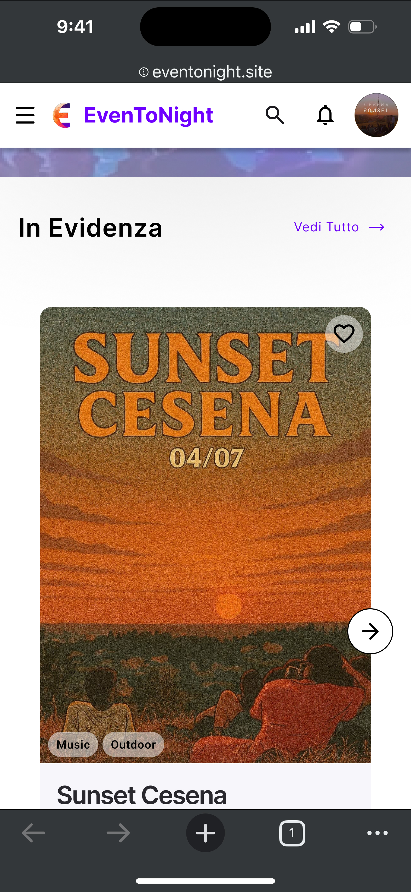
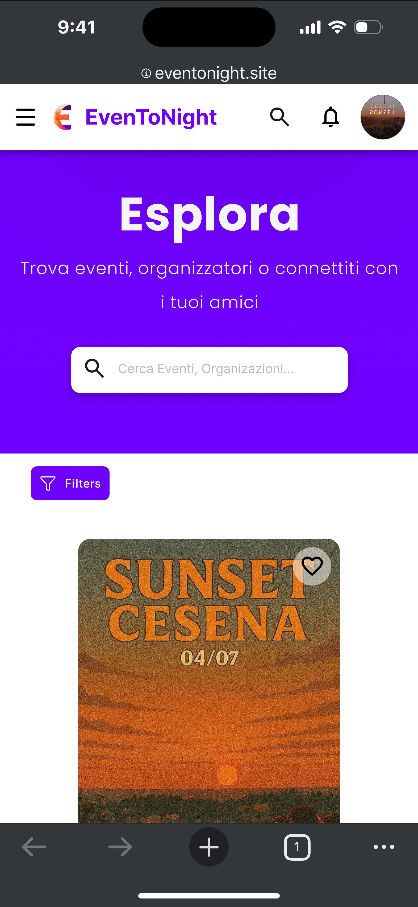

# 3 - Design

## 3.1 – Metodologia progettuale

Lo sviluppo della piattaforma è stato condotto seguendo l’approccio *User Centered Design* (UCD), con l’obiettivo di progettare un sistema conforme ai principi HCI ottimizzando l’esperienza utente.

Per garantire la centralità dell’utente durante il design e lo sviluppo, non potendo coinvolgere utenti reali per l’intero ciclo progettuale, sono state adottate tecniche di virtualizzazione degli utenti promosse da UCD, quali la metodologia ***Personas*** combinata con gli **scenari d’uso**.

### Analisi dei target user

Dopo aver delineato i requisiti di business della piattaforma, il team di sviluppo ha individuato il target di riferimento. La piattaforma è progettata per tre tipologie di utenti: utenti non registrati, utenti registrati e utenti registrati come organizzazione.

Per rappresentare le caratteristiche e i bisogni di ciascun gruppo di utenti del sistema, sono state create delle *Personas*. Per ogni *Personas* è stato inoltre simulato uno scenario d’uso della piattaforma, in modo da evidenziare le diverse modalità di interazione con il sistema e come questo possa rispondere efficacemente alle esigenze degli utenti.

*Personas*: Carlo

Carlo è un adulto appassionato di eventi culturali e spettacoli, ma fatica a scoprire nuove attività tramite i canali di informazione tradizionali. Non ama condividere i propri dati sul web e vuole trovare rapidamente eventi interessanti a cui partecipare, da solo o con amici e familiari.

Carlo ha bisogno di uno strumento semplice e immediato che gli permetta di esplorare gli eventi in programma che lo interessano, capire rapidamente orari, luoghi e dettagli principali, senza dover registrarsi o inserire informazioni personali.

Scenario d’uso:

Carlo visita il sito della piattaforma senza registrarsi, scorre gli eventi in programma e consulta foto, descrizioni e informazioni pratiche come orario e luogo.

Grazie all’interfaccia chiara e semplice, Carlo può farsi un’idea immediata di quali eventi potrebbero interessargli e pianificare eventuali uscite. Pur senza account, ottiene tutte le informazioni necessarie e apprezza poter scoprire eventi diversi rispetto a quelli tradizionali, senza condividere dati personali.

*Personas*: Francesca

Francesca ha 22 anni e si è appena trasferita in una città universitaria vivace. Frequenta il primo anno della magistrale in Comunicazione Digitale e Marketing, divide il suo tempo principalmente tra lezioni e studio, e sente il desiderio di vivere esperienze che la aiutino a integrarsi nella nuova città.

Usa costantemente lo smartphone per restare aggiornata su eventi e tendenze locali. È attratta da contenuti visivi e immediati, come foto con una breve descrizione, che le permettono di percepire rapidamente l’atmosfera di un evento. Apre diverse app e social network alla ricerca di eventi, scorrendo post e pagine locali. Questo processo la stanca: le informazioni sono spesso sparse e incomplete e non sempre riesce a trovare esperienze che le interessano.

Francesca cerca uno strumento che le permetta di scoprire eventi nella nuova città in cui vive, in modo intuitivo e veloce.

Scenario d’uso:

Alla sera, terminato di studiare, Francesca accede alla piattaforma dal suo smartphone ed esplora i prossimi eventi in programma filtrando quelli vicino a lei.

Quando il post di un evento cattura la sua attenzione, controlla la pagina dell’organizzazione per vedere gli eventi passati e leggere le recensioni, così da capire il tipo di esperienze che l’organizzazione propone e valutare se l’evento possa essere affidabile e di suo gradimento. Essendo in una città nuova, queste informazioni la aiutano a scegliere con maggiore sicurezza.

Grazie alla piattaforma, Francesca riesce a trovare rapidamente eventi vicino a lei compatibili con i suoi interessi, ottenendo tutte le informazioni necessarie in un unico luogo e acquistando i biglietti in modo semplice e immediato come è abituata a fare in altre piattaforme.

*Personas*: Emma Lopez

Emma ha 27 anni e vive a Madrid. Sta organizzando un weekend in Italia con le sue amiche e vuole scoprire locali, eventi musicali autentici e buoni ristoranti italiani. Pianifica con attenzione ogni dettaglio ed è importante per lei trovare attività che soddisfino gli interessi di tutte le sue amiche.

Per cercare eventi e locali, Emma usa principalmente il computer. Naviga tra diversi siti, ma non ha un modo comodo e veloce per salvare e confrontare gli eventi che le interessano. Spesso deve tradurre siti italiani per capirne i dettagli. Si affida alle foto per farsi un’idea dell’evento, ma non sa sempre come scegliere quali eventi siano davvero interessanti. Vorrebbe prenotare qualcosa per assicurarsi un posto e godersi la vacanza senza rischiare di perdere gli eventi più popolari.

Scenario d’uso:

Emma si registra sulla piattaforma che trova direttamente in lingua spagnola, essendo in Spagna. Dal suo computer esplora gli eventi filtrando in base alle sue preferenze e a quelle delle sue amiche, per selezionare quelli più adatti al gruppo. Può salvare direttamente i post degli eventi che le interessano e vedere quanti like hanno ricevuto, aiutandola a capire quali sono più popolari. Una volta convinta, acquista i biglietti per lei e per le sue amiche, assicurandosi i posti.

Emma è contenta di poter consultare tutti gli eventi in programma in un unico sito già tradotto nella propria lingua e sfruttare le funzionalità della piattaforma per salvare, gestire, filtrare e prenotare i suoi eventi.

*Personas*: Simone

Simone ha 34 anni e gestisce un locale poco conosciuto in periferia. Crede nelle potenzialità del suo locale: l’ambiente è bello e accogliente, ma fatica a farlo conoscere. Il sito web del locale riceve poche visite e non permette di capire quanti utenti siano interessati agli eventi. Nel locale Simone organizza principalmente cene, ma gli piacerebbe collaborare con organizzatori di spettacoli dal vivo o show da ospitare nel suo locale per aumentare la visibilità e attrarre più clienti.

Simone ha bisogno di uno strumento che gli permetta di promuovere il suo locale, monitorare facilmente l’interesse degli utenti e collaborare con altri organizzatori in modo semplice ed efficace.

Scenario d’uso:

Simone si registra come organizzazione sulla piattaforma e crea il profilo del suo locale, rendendolo visibile a tutti gli utenti. Ogni volta che riceve un nuovo follower o che un suo evento ottiene un like, Simone riceve una notifica che gli fornisce un feedback immediato sull'interesse degli utenti. La piattaforma gli consente inoltre di collaborare con altre organizzazioni, definendo un calendario ricco di eventi per i prossimi mesi presso il suo locale.

Grazie alla piattaforma, Simone vede finalmente il suo locale apprezzato e frequentato.

Dall’analisi dei target user, attraverso le *Personas* e i relativi scenari d’uso, sono emersi i principali task che gli utenti desiderano svolgere sulla piattaforma. Queste informazioni hanno guidato la progettazione dell'interfaccia grafica.

## 3.2 - Progettazione dell'Interfaccia Grafica

In questa sezione viene descritta la progettazione dell'interfaccia grafica dell'applicazione.

L'obiettivo principale è stato quello di definire un design chiaro, intuitivo e coerente, in grado di guidare l'utente attraverso i principali flussi funzionali della piattaforma.

La sezione comprende:

- la presentazione dei **mockup** delle schermate principali;
- una panoramica degli **storyboard**, illustrando i principali flussi di interazione dell’utente.

### Mockup

Per la fase iniziale di progettazione dell'interfaccia grafica sono stati creati dei **mockup**, con l'obiettivo di definire una prima proposta del possibile **look & feel** dell'applicazione, prima di passare all'implementazione vera e propria.

Seguendo un approccio **agile**, i mockup sono stati successivamente sostituiti da **demo funzionanti incrementali**, permettendo di testare e validare progressivamente le funzionalità dell'applicazione.

I mockup sono stati realizzati utilizzando [Figma](https://www.figma.com/). In particolare, sono state sviluppate le schermate delle **tre aree principali** dell'applicazione:

- **Home**
- **Esplora**
- **Profilo**

#### Approccio Mobile-First

La progettazione è stata effettuata seguendo l'approccio **mobile-first**, prendendo come modello di riferimento l’iPhone 16.

Questo approccio è stato scelto principalmente per due motivi:

1. **Vincoli più restrittivi**: il formato mobile costringe a dare priorità ai contenuti più importanti e a semplificare la navigazione, promuovendo un'interfaccia chiara e intuitiva che rispetta il principio **KISS**.
2. **Target principale da smartphone**: la maggior parte degli utenti accederà all'app tramite telefono, quindi è stata data priorità all’ottimizzazione del design per questo genere di dispositivi.

Nel design è stato inoltre seguito il principio **DRY,** riutilizzando ove possibile gli stessi componenti per garantire un aspetto coerente e familiare dell’applicazione. 

Ad ogni modo il design è stato pensato e realizzato anche per essere responsive ed avere successivamente una buona resa anche su schermi desktop.

#### Home

Di seguito è riportato il mockup per la schermata home. Questa è la schermata iniziale proposta all’utente, da cui potrà da subito cercare degli eventi o semplicemente vedere gli eventi proposti in vetrina. Da questa schermata l’utente potrà anche accedere o registrarsi alla piattaforma.

  
  
  

Inizialmente era stata anche proposta una versione alternativa con un diverso sistema di navigazione, che però è stata successivamente scartata vista la scarsa integrazione con il design dell’applicazione, in particolare in combinazione con la schermata **Esplora**.

    
     

#### Esplora

Di seguito è riportato il design della sezione esplora. In questa sezione è possibile andare a visualizzare tutti gli eventi presenti sulla piattaforma e cercare anche tutti gli utenti per visualizzarne il profilo, seguirli e contattare le organizzazioni.

  
  
  

#### Profilo

Da questa schermata l’utente avrà accesso alle sue informazioni, potrà modificare il suo profilo e le sue preferenze.

  

### Storyboard

Di seguito sono riportati alcuni esempi di interazione con l’applicazione, che illustrano i principali flussi di utilizzo.

In particolare, vengono mostrati i seguenti casi d'uso:

- **Esplorare la piattaforma**
- **Login e Registrazione**
- **Creare un evento**
- **Partecipare ad un evento**
- **Recensire un evento**
- **Contattare un’organizzazione**

Le storyboard sono presentate direttamente utilizzando la piattaforma sviluppata, mostrando le principali interazioni dell’utente.

Nel progettare i flussi di navigazione si è sempre tenuto conto della **regola dei tre click**, cercando di rendere le principali funzionalità accessibili in pochi passaggi. Negli esempi riportati di seguito, alcune dinamiche di navigazione secondarie o ripetitive sono state omesse.

### Esplorare la piattaforma

L’utente che apre la piattaforma può iniziare ad esplorarla, in particolare può scoprire gli eventi proposti o cercarli direttamente tramite la barra di ricerca. Nel caso in cui voglia visualizzare maggiori risultati può andare in una pagina dedicata all’esplorazione dei contenuti della piattaforma dove è possibile filtrare gli eventi e cercare in maniera più comoda utenti e organizzazioni.

### Login e Registrazione

Dopo aver aperto l’applicazione, l’utente per accedere alle funzionalità aggiuntive che la piattaforma offre può accedere o registrarsi.

### Creare un evento

Un'organizzazione che si è registrata sulla piattaforma ha la possibilità di creare degli eventi, la creazione avviene attraverso un form in cui inserire tutti i vari dati. Inoltre è possibile anche temporaneamente creare una bozza dell’evento e continuare a modificarla successivamente.

### Partecipare ad un evento

Un utente registrato sulla piattaforma ha la possibilità di acquistare i biglietti per i diversi eventi e visualizzarli in seguito, i biglietti conterranno un QR code che può essere usato dalle organizzazioni per verificarli.

### Recensire un evento

In seguito alla partecipazione ad un evento, un utente può decidere di lasciare una sua recensione. Una volta lasciata non ne può lasciare altre per lo stesso evento ma può modificarla o eliminarla.

### Contattare un’organizzazione

Un utente registrato può avere la necessità di contattare un’organizzazione per chiedere maggiori informazioni o per eventuali problemi.

## 3.3 - Dominio

Durante la fase iniziale di analisi sono state individuate le entità significative del dominio.

Il sistema si basa su due tipologie di utenti, membri e organizzazioni, che condividono una base comune ma possiedono funzionalità differenti. 

I membri rappresentano gli utenti finali della piattaforma e interagiscono con gli eventi pubblicati dalle organizzazioni. Possono esplorare gli eventi applicando filtri quali data, città, prezzo, esprimere interesse tramite like e partecipare agli eventi acquistandone i relativi biglietti. Dopo aver partecipato all’evento, gli utenti possono lasciare recensioni, contribuendo alla valutazione e alla popolarità dell’organizzazione.

Inoltre, possono seguire altri utenti e comunicare direttamente con le organizzazioni tramite messaggi.

Le organizzazioni, oltre alle funzionalità comuni ai membri, hanno la possibilità di creare e gestire eventi, definendone le informazioni e rendendoli disponibili sulla piattaforma. Possono inoltre ricevere recensioni da utenti che hanno partecipato ai loro eventi.

Tutti gli utenti ricevono delle notifiche a seguito di eventi di dominio che li riguardano.

Da questa analisi emergono le principali entità del dominio, tra cui utenti, eventi, biglietti, notifiche e interazioni, che costituiscono la base per il design delle API e dell’architettura del sistema.

## 3.4 - Design delle risorse

A partire dall’analisi del dominio, sono state definite come principali risorse gli utenti e gli eventi. 

Oltre alle risorse principali, il sistema modella ulteriori risorse rilevanti, come:

- **tickets**, associati agli eventi
- **conversations**, per la comunicazione tra utenti
- **interactions**, che aggregano like, review e follow
- **notifications,** associate agli utenti

Questo approccio permette di mantenere un modello REST coerente e facilmente estendibile.

### /users

La risorsa /users rappresenta gli utenti del sistema ed è modellata secondo l’archetipo **collection**, mentre /users/{userId} rappresenta una risorsa **document**.

Ad ogni utente sono associate anche ulteriori **sotto-risorse** (altre **collection**), tra cui:

- /users/{userId}/likes
- /users/{userId}/reviews
- /users/{userId}/followers
- /users/{userId}/following
- /users/{userId}/events
- /users/{userId}/conversations
- /users/{userId}/notifications

Alcuni endpoint seguono l'archetipo del **controller** in quanto escono dal classico paradigma RESTfull indicando delle azioni, ad esempio:
- /users/login
- /users/register

### /events

La risorsa /events rappresenta l’insieme degli eventi disponibili nel sistema (archetipo **collection**), mentre /events/{eventId} rappresenta un singolo evento (**document**).

Ad ogni evento sono associate anche ulteriori **sotto-risorse** (altre **collection**), tra cui:

- /events/{eventId}/participants
- /events/{eventId}/likes
- /events/{eventId}/reviews
- /events/{eventId}/tickets

Su alcuni endpoint vengono utilizzati dei query params per filtrare i dati delle collections ed effettuare una richiesta paginata tramite limit e offset, ad esempio:

- /events/search?query=sunset&limit=10&offset=0&orderBy=date

## 3.5 - Design delle API

Le API sono state progettate seguendo i principi del REST API Design, con particolare attenzione all’uso corretto dei metodi HTTP, all’utilizzo di sostantivi negli url e al rispetto degli archetipi REST.

Alcuni esempi di API implementate seguendo i principi citati:

Ogni microservizio espone una documentazione **Swagger/OpenAPI**, che descrive endpoint, input e possibili risposte HTTP.

Swagger è stato utilizzato sia come strumento di documentazione che come supporto al testing manuale delle API. Di seguito il link [https://eventonight.github.io/EvenToNight/openAPI/](https://eventonight.github.io/EvenToNight/openAPI/)

## 3.6 - Architettura

L’architettura del sistema è basata su un insieme di microservizi indipendenti, ciascuno responsabile di un sotto-dominio applicativo specifico.

Il frontend rappresenta il punto di accesso per gli utenti e comunica esclusivamente con i servizi backend tramite API REST e socket, senza accesso diretto ai database.

Ogni servizio infatti possiede la propria logica di business, entità comuni a più servizi (es. gli eventi) vengono rappresentati in maniera diversa in ognuno di essi.

Ogni servizio è containerizzato tramite Docker, comunica con gli altri servizi principalmente tramite messaggi asincroni ed espone un insieme coerente di API REST.

Le risorse individuate nella fase precedente sono state organizzate e distribuite nei vari servizi, di seguito una breve descizione.

Il servizio *users* è responsabile della gestione delle risorse utente e di una parte delle relative sotto-risorse. 
Per ogni utente, il sistema gestisce l'auenticazione e le informazioni riguardanti l’account (e.g username, email, interessi) e il profilo (e.g. nome, bio).

Il servizio *events* è responsabile della gestione delle risorse eventi e delle loro informazioni. Gestisce sia gli aspetti di creazione degli eventi sia il recupero degli eventi filtrati in base a caratteristiche specificate (e.g.popolari, interessi).

Il servizio *interactions* è responsabile di alcune sotto-risorse degli utenti e degli eventi. In particolare, gestisce tutte le informazioni riguardanti le interazioni che un utente può avere con un evento o con un altro utente. Tra le interazioni con gli eventi sono stati implementati i likes, le reviews e le partecipazioni, mentre con gli altri utenti è stato implementato un sistema di following.

Il servizio *chat* è responsabile di alcune sotto-risorse degli utenti. In particolare, gestisce tutte le informazioni riguardanti le conversazioni che l’utente può avere con altri utenti.

Il servizio payments è responsabile di alcune risorse degli utenti e degli eventi, in particolare della gestione dei biglietti che gli utenti possono acquistare per partecipare agli eventi.

Il servizio *notifications* è responsabile di alcune sotto-risorse degli utenti, in particolare gestisce tutte le informazioni riguardanti le notifiche che un utente riceve. Le notifiche possono essere di tipi diversi, quali like ricevuto, review ricevuta, nuovo follower o nuovo evento creato da un’organizzazione seguita. Si occupa anche di notificare l’arrivo di un nuovo messaggio, gestito poi dal servizio chat.

## 3.7 - Comunicazione: RabbitMQ e Socket.IO

Per la comunicazione tra servizi abbiamo utilizzato un broker di messaggi, in particolare RabbitMQ. Ogni servizio definisce alcuni *domain event* *(e.g. nuovo evento pubblicato, like aggiunto, utente creato)* e li comunica sull’exchange *eventonight*, al quale sono connesse e in ascolto le code dei vari servizi.

Per funzionalità che richiedono aggiornamento in tempo reale (come le notifiche e le chat) abbiamo utilizzato una comunicazione basata su socket centralizzandola nel servizio notifications in modo da aprire una sola connessione con ciascun client. Il servizio notifications tramite RabbitMQ ascolta tutti i *domain event* che vogliamo comunicare real-time, li elabora e quando necessario li inoltra nei canali degli utenti connessi interessati.
